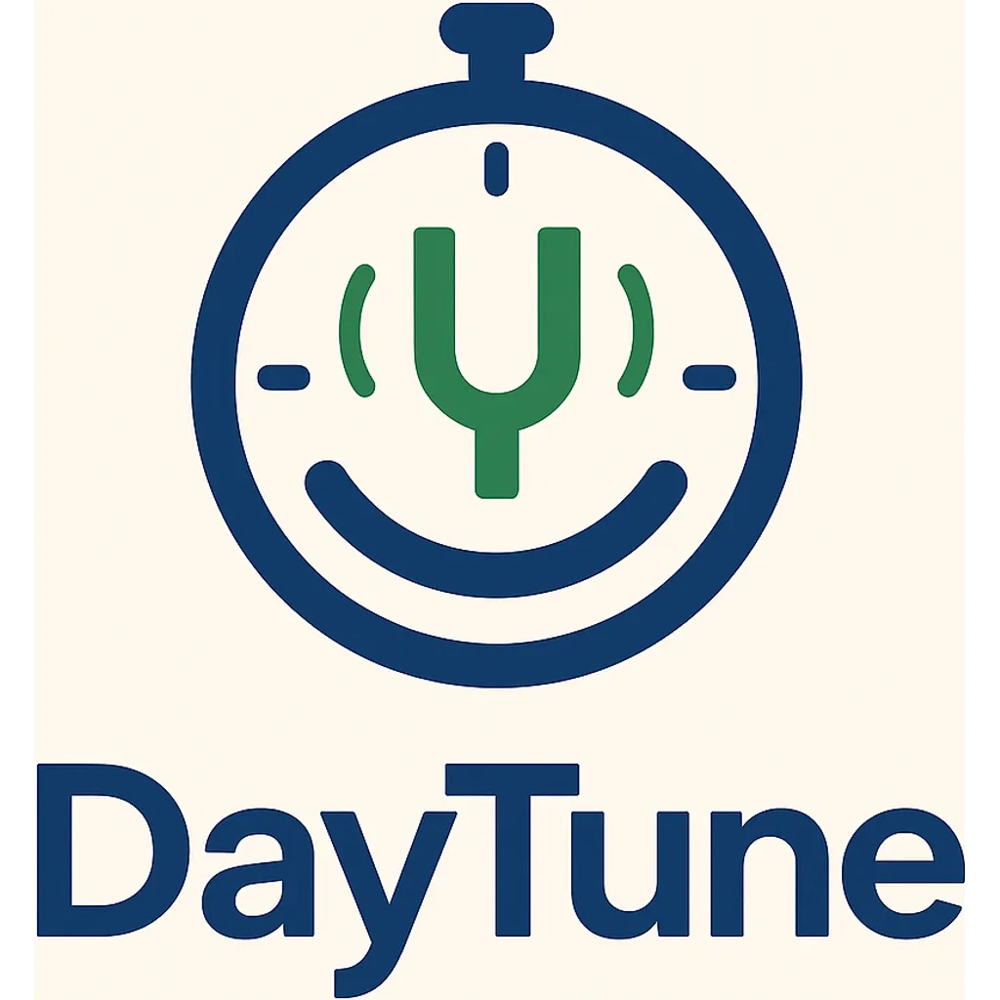

Built by Shriya Machanpalli and Rishi Machanpalli

# 🌞 DayTune — Your Adaptive Daily Rhythm

**"Tune your day to your energy, not the other way around."**

---



## 🔥 Core Insight
Most planners freeze your schedule in place — but real life never cooperates.
DayTune listens to how you feel and how your day is shifting, then re‑tunes your calendar in seconds — protecting what matters and trimming what doesn't. It's not about cramming more hours in; it's about making smarter trade‑offs moment‑to‑moment.

---

## 💡 Feature Pillars
| Pillar                  | What It Does                                                                 | Example Prompt                                                      |
|------------------------|------------------------------------------------------------------------------|---------------------------------------------------------------------|
| **Live Day Re‑tuner**  | Auto‑reshuffles tasks when meetings overrun or you finish late/early.         | "Your client call ran 22 min long. Shorten admin or bump workout?"   |
| **Energy‑Aware Planning** | Morning "pulse check" + evening reflection. Adjusts ambition level based on energy state. | "Feeling foggy? We'll swap deep work for light review and keep your nap." |
| **Life‑Smart Task Types** | Tag tasks as Fixed / Flexible / Movable and by life area.                    | "Design review (Fixed), weekly report (Flexible), read journal (Movable)." |
| **Reflection & Nudges** | Gentle evening prompts suggest smarter routines and task timing.              | "Deep work slipped again—schedule it before noon tomorrow?"          |
| **Passive Energy Sensing** | Sync with Apple Watch or monitor browser activity to detect low energy and trigger contextual nudges. | "Looks like your energy's been low for a bit. Want to re-tune your day?" |

---

## 🎯 Target Users
- Students juggling classes, studying, and social chaos
- Remote freelancers & founders in meeting/maker-mode mashups
- ADHD & neurodiverse professionals needing emotion-responsive structure
- Solo pros/consultants where overrun tasks impact income or sleep

---

## 💸 Monetization
| Tier   | Includes                                         | Price      |
|--------|--------------------------------------------------|------------|
| Free   | Google/Outlook calendar sync, 2 mood check-ins/day | $0         |
| Pro    | Unlimited re-tunes, energy logic, reflection history | $6.99/mo   |
| Team   | Shared rebalancing, Jira/Slack/Asana bridges      | $12/seat   |

_Add-ons: Pomodoro mode, wellness nudges, student integrations, and an AI Accountability Coach ($4–8/mo) offer additional upsell paths._

---

## 🏆 Competitive Edge
| Competitor         | Where They Stop         | Where DayTune Wins                |
|-------------------|------------------------|-----------------------------------|
| Google Calendar   | Static blocks          | Real‑time re‑tunes                |
| Motion            | Auto‑planning, no emotions | Mood + wellness logic         |
| FlowSavvy/Reclaim | Reschedules tasks      | Energy check‑ins & ADHD framing   |
| Notion, Sunsama   | Manual workflows       | One‑click "Make today sane" button|

---

## 🛠 MVP — Build Fast, Prove the Magic
- Fixed/Flexible/Movable task tagging in a minimalist web app
- Morning + night pulse (emoji slider → "foggy / focused / flexible")
- Google Calendar read/write (planned)
- "Re‑Tune My Day" button (simple backend logic, no ML yet)
- Passive browser activity sensing (for low-focus detection, planned)
- (Optional) Chrome overlay or mobile-lite view
- (Optional) Simulated Apple Watch energy sync for testing

**Stack:** React + Tailwind · Supabase · OpenAI (for copy assist)

---

## 📈 Growth Roadmap
| Phase      | Goal                        | Timeline      |
|------------|-----------------------------|---------------|
| Alpha      | 100 closed beta users       | Week 0–4      |
| MVP Public | 1,000 users, 100 Pro trials | Month 2       |
| V1         | Slack/Zoom triggers, Pro paywall live | Month 3–4 |
| V2         | Jira / GitHub plug-ins, mobile app | Month 6–8 |

---

## 🔗 Must‑Have Integrations (Planned)
- Google/Outlook Calendar – Core schedule sync
- Slack – Mood check-ins, team nudges
- Jira / GitHub – Developer task ingestion
- Zoom – Detect overruns, auto-triggers
- Notion / Asana – Task + reflection integration
- Apple HealthKit (optional) – Sleep, HRV, activity for passive energy sensing

---

## 🧠 Dual‑Mode UX
| Mode   | For                    | Defaults                                 |
|--------|------------------------|------------------------------------------|
| Simple | Students, ADHD users   | Minimal UI, emoji check-ins, no setup    |
| Pro    | Founders, devs, PMs    | Deep plug-ins, override rules, dashboards|

_Smart onboarding detects tools (e.g. Jira, Apple Health) and configures mode._

---

## 👥 Use‑Case Snapshots
- **Alex (Remote Engineer):** Stand-up overruns → deep work pushed to tomorrow
- **Maya (ADHD Student):** Low-energy morning → flash-card review instead of reading
- **Sam (Freelancer):** Client ping → DayTune auto-adjusts and protects lunch
- **4-Founder Team:** One slip-up → timeline shifts, Slack notifies everyone

---

## 🧩 Defensibility & Vision
- Behavioral Graph of energy/time trade-offs → potential burnout prediction
- Emotional UX Moat for neurodiverse users before big players catch on
- Integration Hub makes DayTune the "nervous system" of personal/work planning

**DayTune is poised to be the "noise-cancelling headphones for your calendar."**
_Slip it on, and the chaos of shifting tasks fades into a rhythm that finally fits you._

---

## 🚦 Current Progress
### ✅ Completed Features
- Authentication (Supabase)
- Mood check-ins (manual, scheduled)
- Task CRUD, tagging, priority, duration
- Weekly calendar view
- "Re-Tune My Day" button (basic logic)
- Modern, responsive UI

### ⚠️ Partially Complete
- Task scheduling (basic, not AI-driven)
- Break system (basic)
- Overrun handling (basic)
- User preferences (basic)

### ❌ Not Started/Planned
- Google Calendar/Jira/Slack integration
- Mood-based scheduling
- Reflection/nudges
- Passive energy sensing
- Advanced analytics
- Mobile app
- Team features

---

## 🚀 Getting Started
### Prerequisites
- Node.js (v14 or higher)
- Yarn (recommended)
- Supabase account

### Installation
1. Clone the repository:
   ```sh
   git clone https://github.com/DayTuneDev/daytune.git
   cd daytune
   ```
2. Install dependencies:
   ```sh
   yarn install
   ```
3. Create a `.env` file in the project root with your Supabase credentials:
   ```env
   REACT_APP_SUPABASE_URL=your_supabase_url_here
   REACT_APP_SUPABASE_ANON_KEY=your_supabase_anon_key_here
   ```
4. Start the development server:
   ```sh
   yarn start
   ```
   Open [http://localhost:3000](http://localhost:3000) to view it in your browser.

---

## 📚 Learn More
- [React documentation](https://reactjs.org/)
- [Supabase documentation](https://supabase.com/docs)

---

_This project was bootstrapped with [Create React App](https://github.com/facebook/create-react-app)._

## Available Scripts

In the project directory, you can run:

### `npm start`

Runs the app in the development mode.\
Open [http://localhost:3000](http://localhost:3000) to view it in your browser.

The page will reload when you make changes.\
You may also see any lint errors in the console.

### `npm test`

Launches the test runner in the interactive watch mode.\
See the section about [running tests](https://facebook.github.io/create-react-app/docs/running-tests) for more information.

### `npm run build`

Builds the app for production to the `build` folder.\
It correctly bundles React in production mode and optimizes the build for the best performance.

The build is minified and the filenames include the hashes.\
Your app is ready to be deployed!

See the section about [deployment](https://facebook.github.io/create-react-app/docs/deployment) for more information.

### `npm run eject`

**Note: this is a one-way operation. Once you `eject`, you can't go back!**

If you aren't satisfied with the build tool and configuration choices, you can `eject` at any time. This command will remove the single build dependency from your project.

Instead, it will copy all the configuration files and the transitive dependencies (webpack, Babel, ESLint, etc) right into your project so you have full control over them. All of the commands except `eject` will still work, but they will point to the copied scripts so you can tweak them. At this point you're on your own.

You don't have to ever use `eject`. The curated feature set is suitable for small and middle deployments, and you shouldn't feel obligated to use this feature. However we understand that this tool wouldn't be useful if you couldn't customize it when you are ready for it.

## Learn More

You can learn more in the [Create React App documentation](https://facebook.github.io/create-react-app/docs/getting-started).

To learn React, check out the [React documentation](https://reactjs.org/).

### Code Splitting

This section has moved here: [https://facebook.github.io/create-react-app/docs/code-splitting](https://facebook.github.io/create-react-app/docs/code-splitting)

### Analyzing the Bundle Size

This section has moved here: [https://facebook.github.io/create-react-app/docs/analyzing-the-bundle-size](https://facebook.github.io/create-react-app/docs/analyzing-the-bundle-size)

### Making a Progressive Web App

This section has moved here: [https://facebook.github.io/create-react-app/docs/making-a-progressive-web-app](https://facebook.github.io/create-react-app/docs/making-a-progressive-web-app)

### Advanced Configuration

This section has moved here: [https://facebook.github.io/create-react-app/docs/advanced-configuration](https://facebook.github.io/create-react-app/docs/advanced-configuration)

### Deployment

This section has moved here: [https://facebook.github.io/create-react-app/docs/deployment](https://facebook.github.io/create-react-app/docs/deployment)

### `npm run build` fails to minify

This section has moved here: [https://facebook.github.io/create-react-app/docs/troubleshooting#npm-run-build-fails-to-minify](https://facebook.github.io/create-react-app/docs/troubleshooting#npm-run-build-fails-to-minify)

## 🧪 Testing

We use **Jest** and **React Testing Library** for unit and integration tests.

### Run all tests
```sh
yarn test
```

### Example Test (MoodCheckin)
```jsx
import { render, screen, fireEvent } from '@testing-library/react';
import MoodCheckin from '../src/components/MoodCheckin';

test('renders mood check-in options', () => {
  render(<MoodCheckin />);
  expect(screen.getByText(/How are you feeling/i)).toBeInTheDocument();
});
```

- Place your test files as `ComponentName.test.js` or `ComponentName.test.jsx` in the same folder as the component or in a `__tests__` directory.
- For coverage, run:
```sh
yarn test --coverage
```
